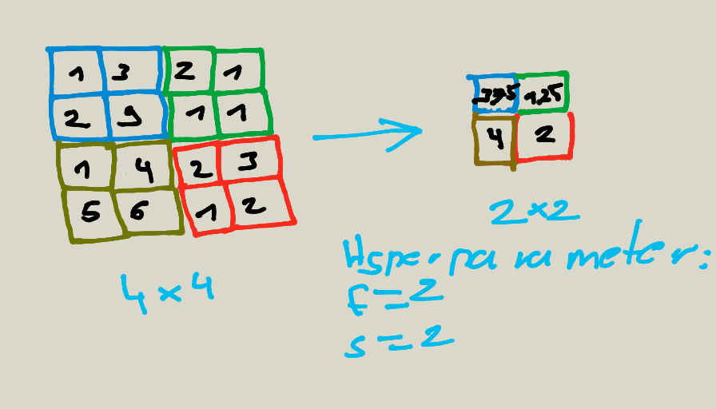

# Convolution neural networks

## Example of Layer

If layer l is a convolution layer:

* f[l] = fliter size
* p[l] = padding
* s[l] = stride
* nc[l] = number of filters 
* Input: n * n * nc
* output n * n * nc
* Each filter is: f[l] * f[l] *nc

## A Simple Convolution Network Example

## Types of layer in convolutionl network

* Convolution (conv)
* Pooling (pool)
* Fully connected (fc)

## Pooling layer: Max pooling

Take out from each coloured section the max value 

## Pooling layer: Average pooling

Calculate for each coloured section th  e average value

## Convolutional Neural Network Example

## Why Convolutions

* Parameter sharing: A feature detector (such as vertical edge detector) that's useful in one part of the image is probably useful in
another part of the image
* Sparsity of connections: In each layer, each output value depends only on a small numbers of inputs

## Classic networks

* LeNet-5 
* AlexNet
* VGG

## New networks

* ResNet
* Inception (RNN)

## Papers

* [Gradient-based learning applied to document recognition](http://yann.lecun.com/exdb/publis/pdf/lecun-01a.pdf)
* [ImageNet Classification with Deep Convolutional
Neural Networks](https://papers.nips.cc/paper/4824-imagenet-classification-with-deep-convolutional-neural-networks.pdf)
* [Very Deep Convolutional Networks for Large-Scale Image Recognition](https://arxiv.org/pdf/1409.1556.pdf)
* [Deep Residual Learning for Image Recognition](https://arxiv.org/pdf/1512.03385.pdf)