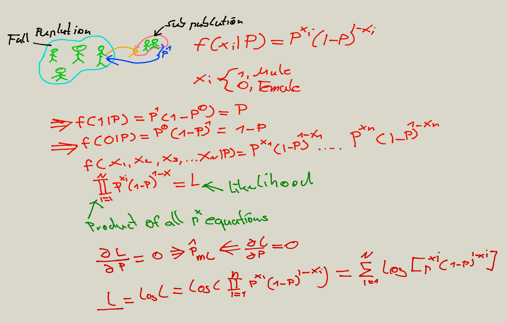
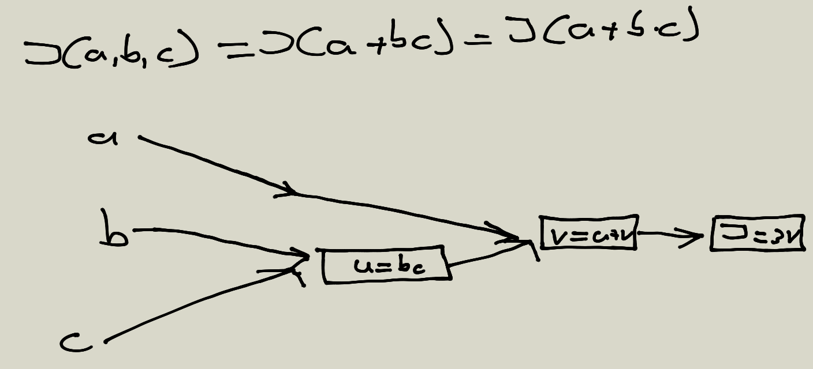
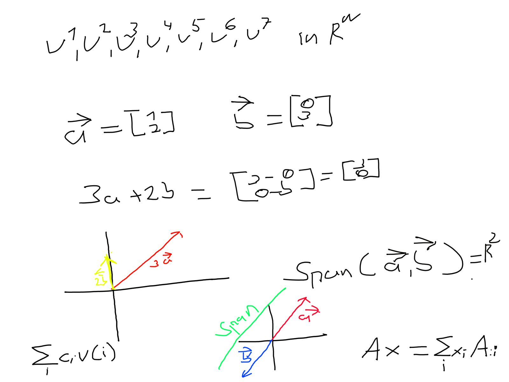
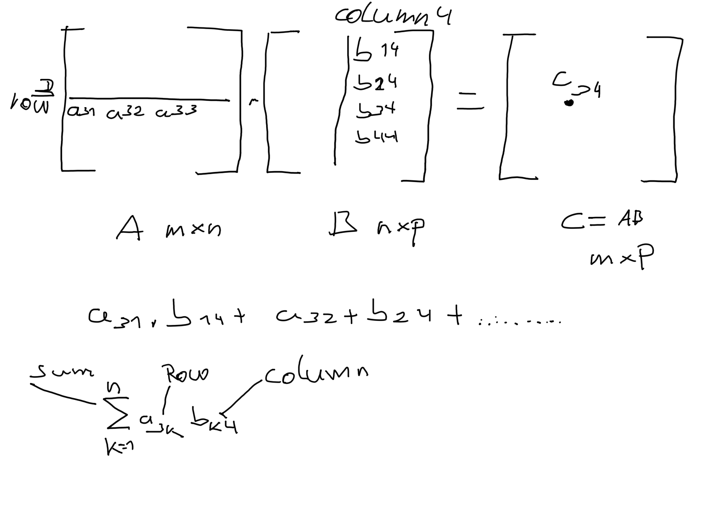
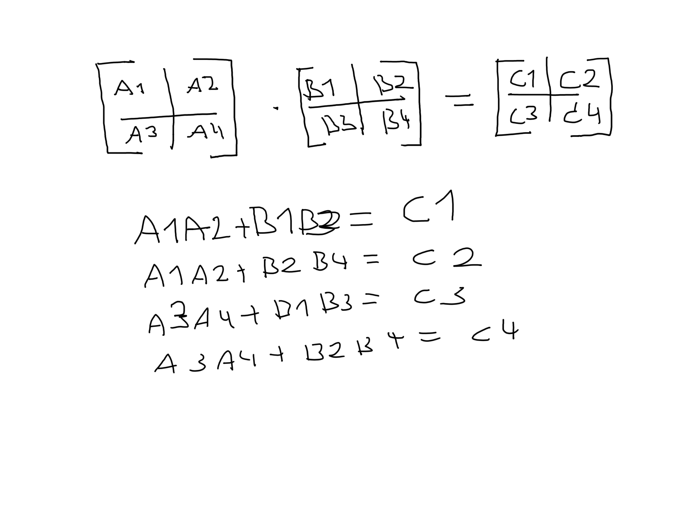
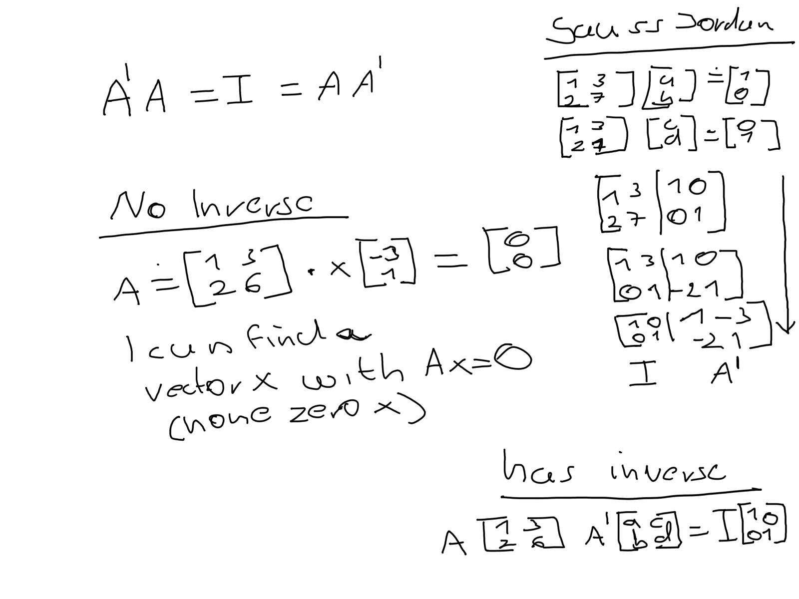
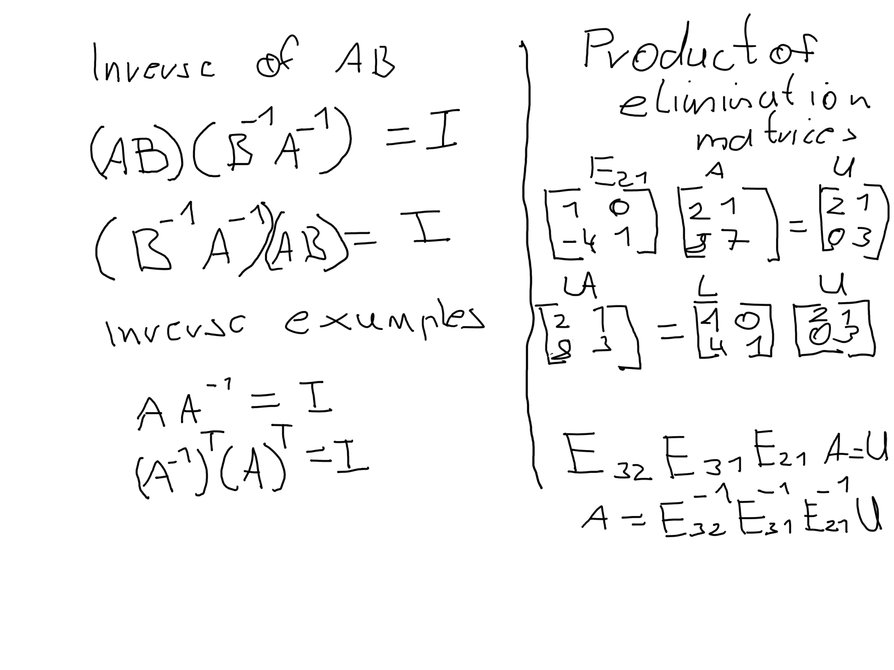

# Maximum Likelihood estimation

# Intuition about derivatives

# Computation Graph

# Linear combinations and span

# Matrix Multiplication

# Block Matrix Multiplication

# Matrix Inverse 

