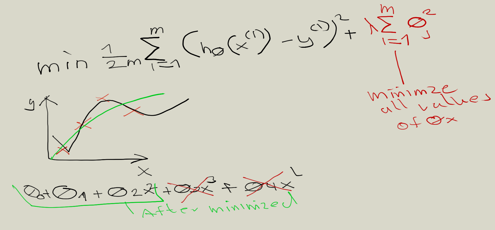
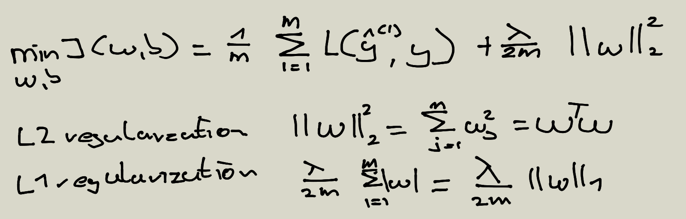
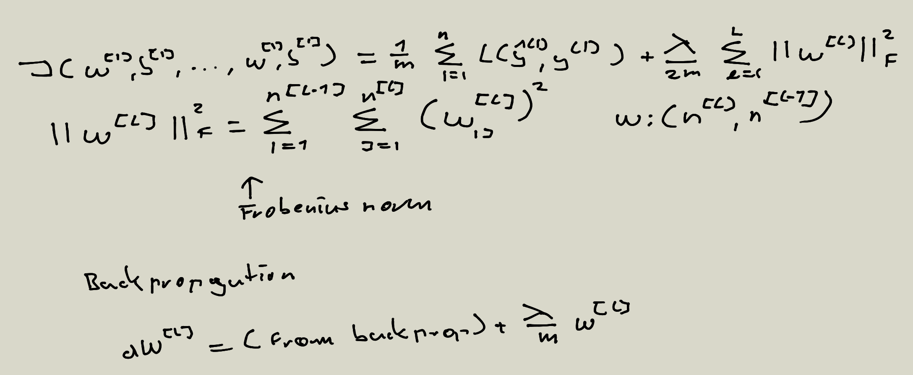
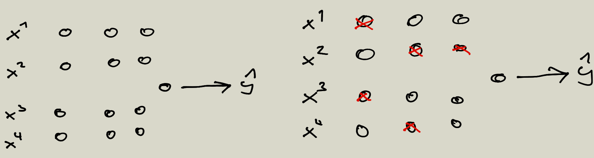
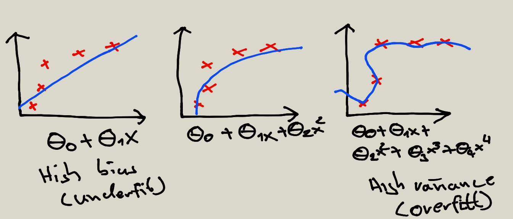
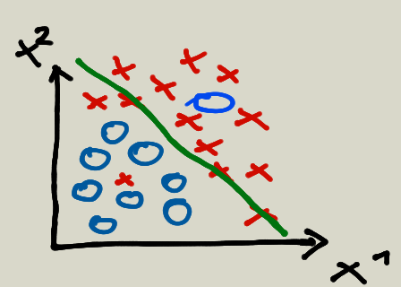
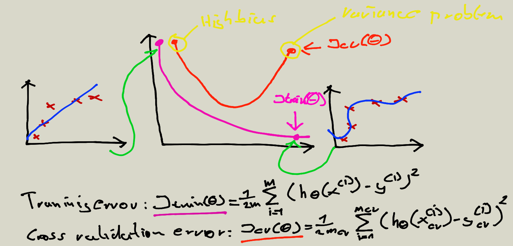
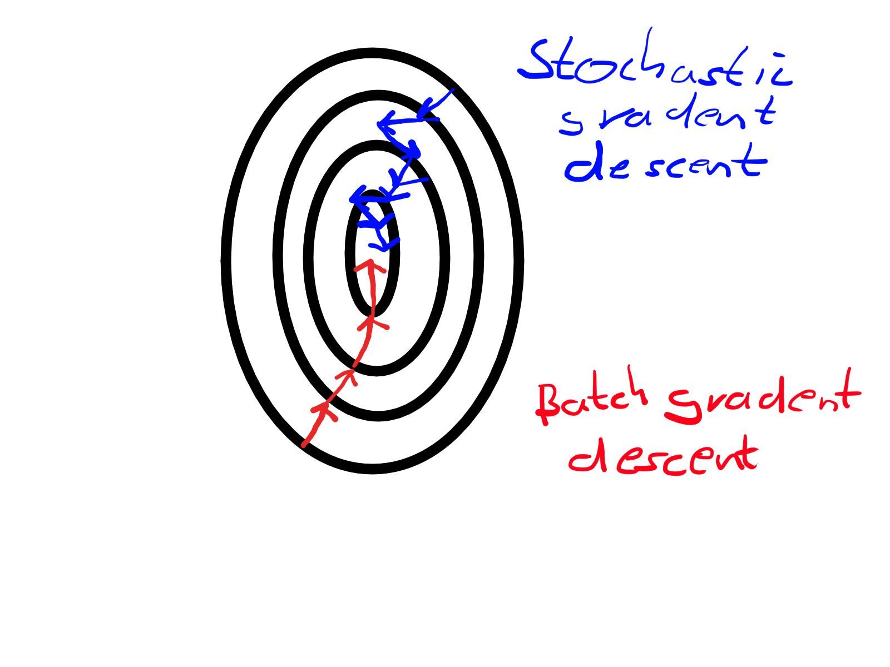

# Convention 

```math
y' = b + w1 * x1
```

where:

* y' is the predicted label (a output)
* b is the bias (the y-intercept). In some machine learning documentation it is instead referred to as w0
* w1 is the weight of feature 1. Weight is the same concept as slope written with m above
* x1 is feature (a input)


## Squared loss

the square of the difference between the label and the prediction

```math
(observation - prediction(x))2 = (y - y')2
```

## Weight initialization 

* For convex problems, weights can start anywhere
    * Convex: think of a bowl shape 
    * Just one minimum
* Forshadowing: not true for neural nets
    * Non-convex: think of an egg crate
    * More than one minimum
    * Strong dependency on initial values    

## feature cross

A feature cross is a synthetic feature that encodes nonlinearity in the feature space by multiplying two or more input features together. (The term cross comes from cross product.) Let's create a feature cross named x3 by crossing x1 and x2:    

x3 = x1 * x2

We treat this newly minted x3 feature cross just like any other feature. The linear formula becomes:

y = b + w1 * x1 + w2 * x2 + w3 * x3

## Labels

A label is the thing we're predicting—the y variable in simple linear regression. The label could be the future price of wheat, the kind of animal shown in a picture, the meaning of an audio clip, or just about anything

## Features

A feature is an input variable—the x variable in simple linear regression. A simple machine learning project might use a single feature, while a more sophisticated machine learning project could use millions of features

## Regularization (Simpler hypothesis)

In other words, instead of simply aiming to minimize loss (empirical risk minimization):

minimize(Loss(Data|Model))

we'll now minimize loss+complexity, which is called structural risk minimization:

minimize(Loss(Data|Model) + complexity(Model))

Our training optimization algorithm is now a function of two terms: the loss term, which measures how well the model fits the data, and the regularization term, which measures model complexity.

* Model complexity as a function of the weights of all the features in the model.
* Model complexity as a function of the total number of features with nonzero weights. 

We can quantify complexity using the L2 regularization formula

### Example 



Reduced polynomial to quadratic function to reduce minimze complexity

### Logistic regression regularization



### Nerual Network Regularization



## Nerual Network Dropout Regularization



## Multi-class perceptron

Let CC denote the number of output classes. We want to perform multiple linear classifications in parallel, one for each of the CC classes. To do this, we introduce a weight vector for each class (w1,w2,…,wCw1,w2,…,wC) and a bias value for each class (b1,b2,…,bCb1,b2,…,bC). The output of our perceptron should now be a CC-dimensional vector, each of whose entries contains the probability of the respective class:

$$output = \left( 
\begin{array}{c} 
\sigma(w_1^Tx + b_1)\\ 
\sigma(w_2^Tx + b_2)\\ 
…\\ 
\sigma(w_C^Tx + b_C)\\ 
\end{array} 
\right)$$

## Softmax

When the output classes are disjoint, the output probabilities should sum up to one. In this case, we apply the softmax function to the vector a = xW + b  instead of the element-wise sigmoid, which makes sure that each probability is between 0 and 1 and the sum of the probabilities is 1:

$$\sigma(a)_i = \frac{e^{a_i}}{\sum_{j = 1}^C e^{a_j}}$$

## Debugging a learning algorithm

* Get more tranining examples 
* Try smaller sets of features 
* Try getting additional features 
* Try adding polynomial features 
* Try decreasing lamda
* Try inreasing lamba

## Bias/Variance



## High bias and high variance



## Diagnosing Bias vs Variance



## Overfitting (High variance)

if we have too many features, the learned hypothesis may fit the training set very well, but fail to generalize to new examples (predict values on new examples)

### Addressing overfitting

* Reduce number of features
    * Manually select which features to keep 
    * Model selection algorithm (automatically choosing of features)


### Gradient descent

#### Batch vs stochastic




### What is weight decay

* A regularization technique (such as L2 regularization) that results in gradient descent shrinking the weights on every iteration.

 ## Error analysis (Recommended approach)

 * Start with a simple algorithm that you can implement quickly, Implement it and test it on your cross validation data.
 * Plot learning curves to decide if more data, more features, etc are likley to help.
 * Error analysis: Manually examine the examples (in cross validation set) that your algorithm made errors on. See if you spot 
 any systematic trend in what type of examples it is making errors on.

 ### Example 
 * mcv = 500 examples in cross validation set 
 * Alogrithm misclassifies 100 mails
 * Manually examine the 100 errors, and categorize them based on 
    * What type of email it is 
    * What cues (features) you think would have helped the algorithm classify them correctly
