# Neural networks

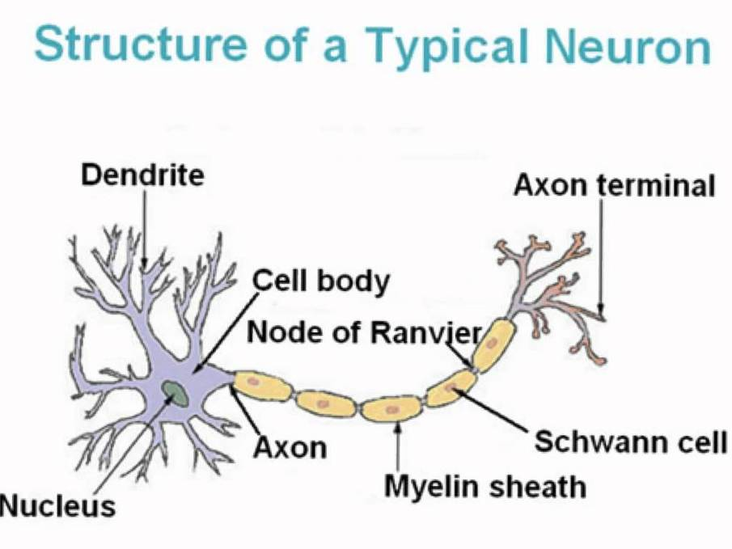

## Legend
* Input wries == Dendrite 
* Output wire == Axon

## Neuron model: Logistic unit

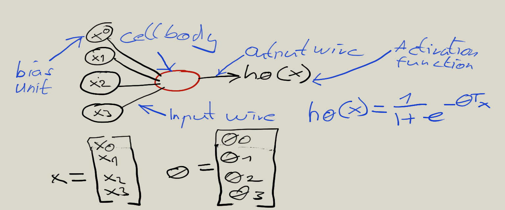

## Neural Network

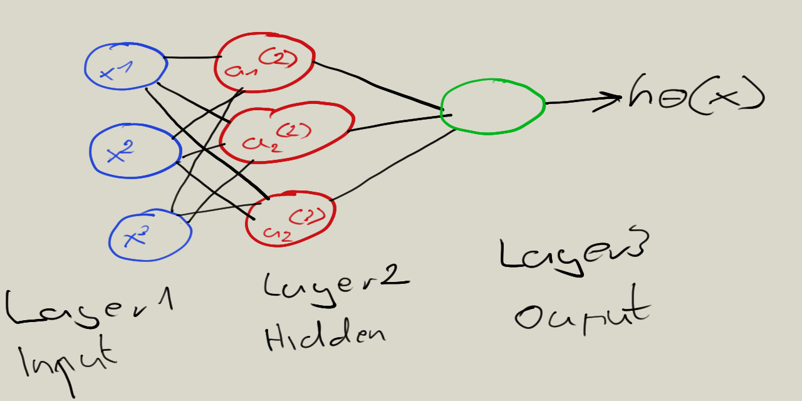

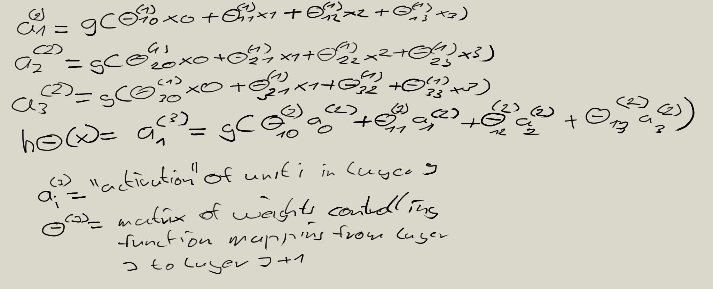

if network has sj units in layer j, sj + 1 units in layer j + 1, 0j then will be of diemension sj+1 * (sj +1). 

### Housing Price Prediction Example 

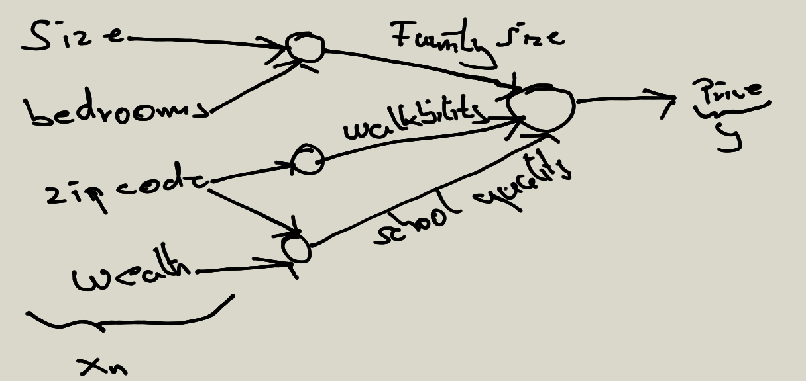

### Other Neural Network Architectures

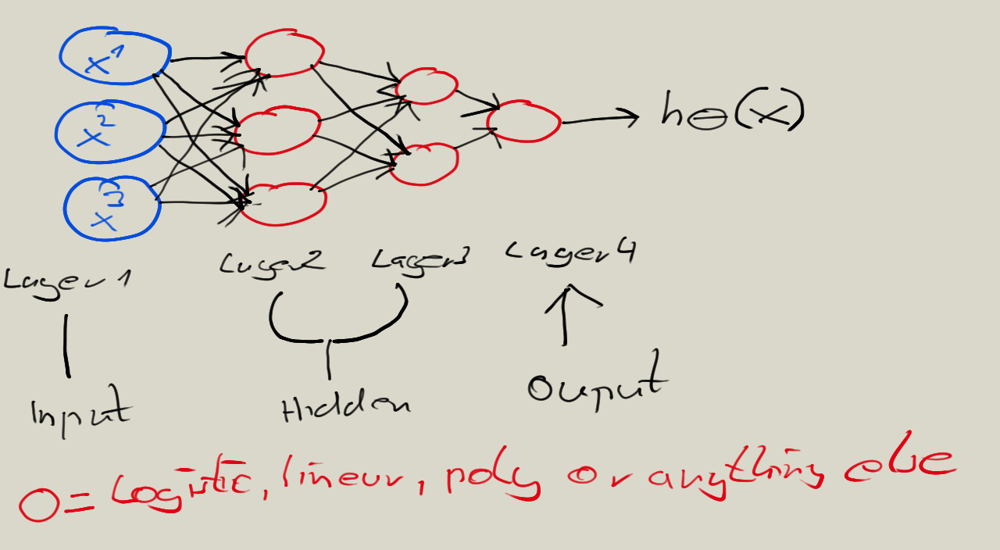

### Binary Neural Network (AND)

### Binary Neural Network (XNOR)

### Neural network logistic regression cost function

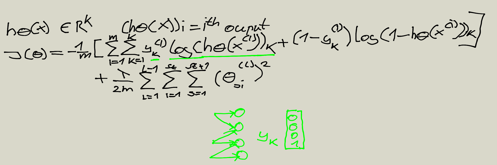

### Back propagation 

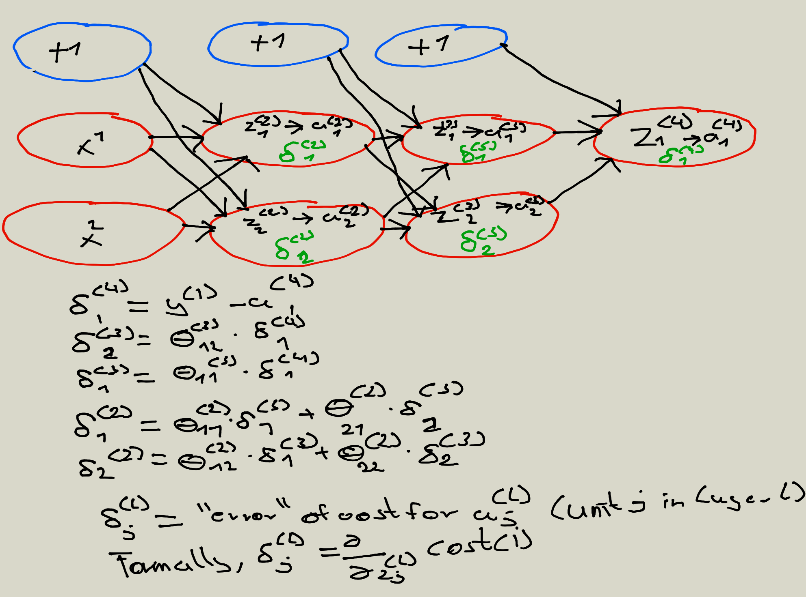

### Gradient decent

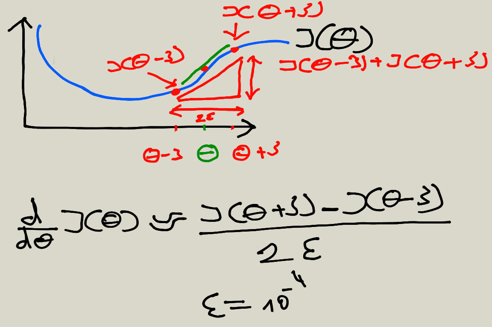)

### Training a neural network 

Pick a network architecture (connecctivity pattern between neurons)

* No. of input uints: Dimension of features x
* No. of output uints: number of classes 
* Reasonable default: 1 hidden layer, or if > 1 hidden layer, have same no. of hidden units in every layer (usually the more the better)

1. Randomly initialize weights
2. Implement forward propagation to get h(theta)(xte) for any xte
3. Implement code to compute cost j(theta)
4. Implement back propagagtion to compute partial derivatives
5. Perform forward propagation and back propagation using (xte and yte)
6. Get activations a(l) and delta(l) terms for l =2.....,L
7. Use gradient checking to compare partial derivatives computed using back propagation vs using numerical estimate of gradient decent of j(theta) then disable gradient checking code 
8. Use gradient descent or advanced optimization method with back propagation to try to minimize j(theta) as a function of parameters (theta)

### Neural network computing graph

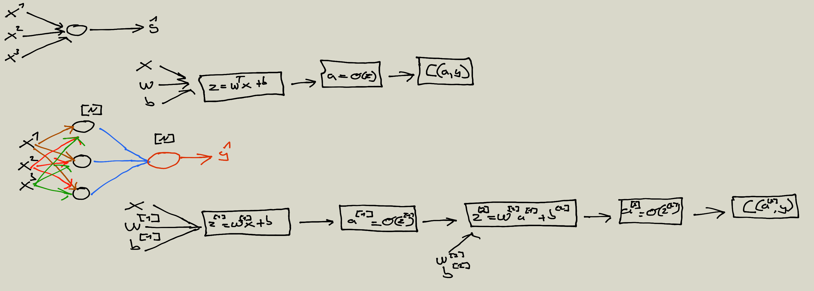

## Activation functions

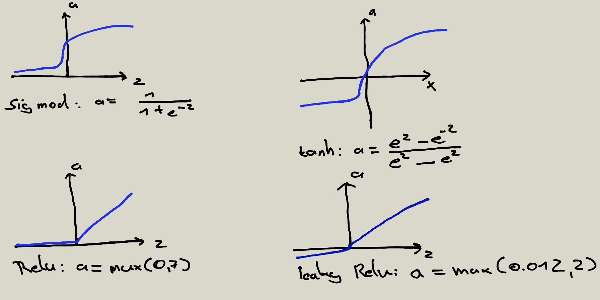

## Derivatives of activation functions

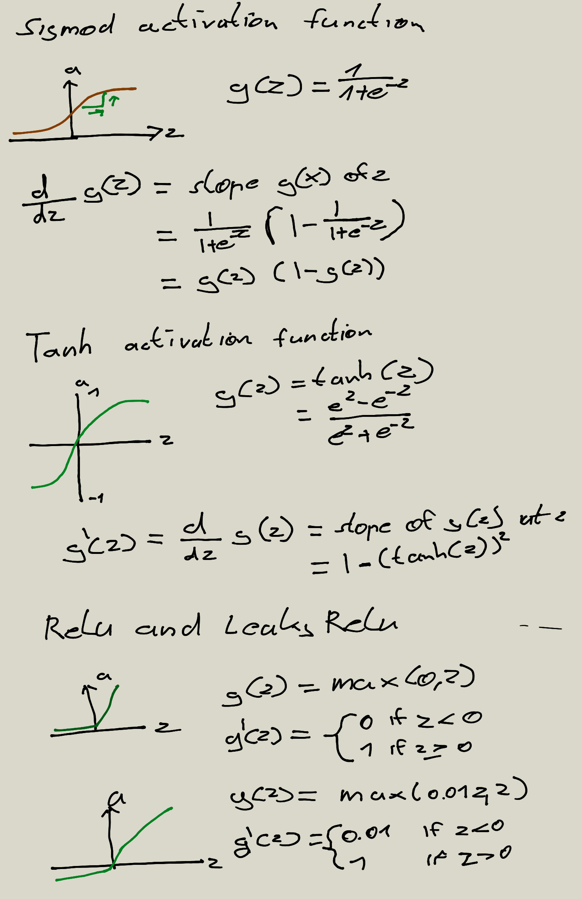 

## Gradient descent for Neural Networks

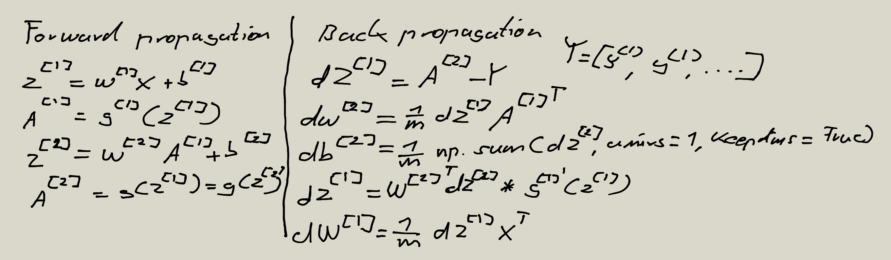

# Matrix dimensions 

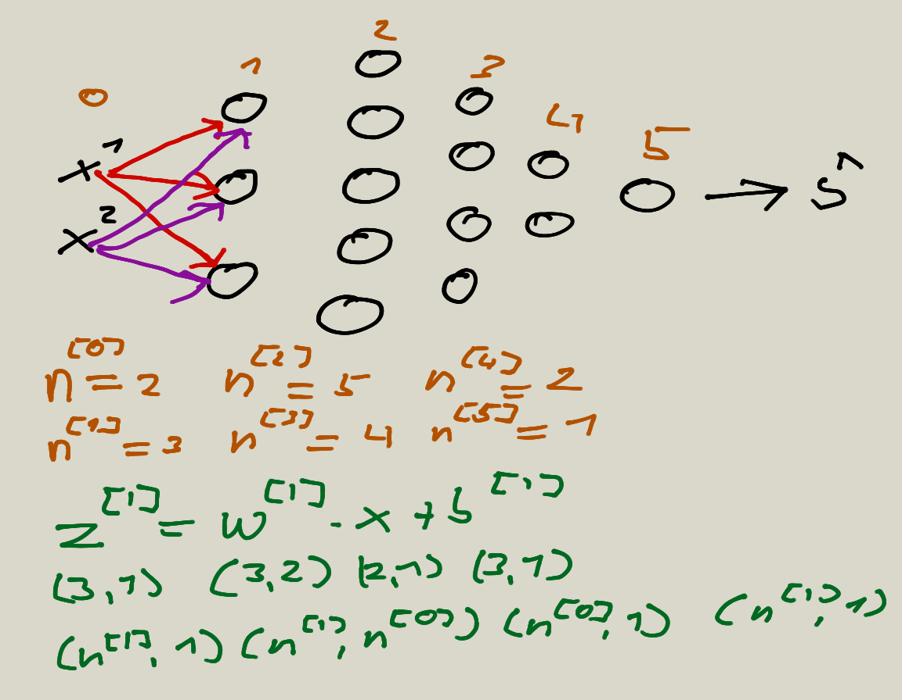

# Building blocks of Deep Neural Networks

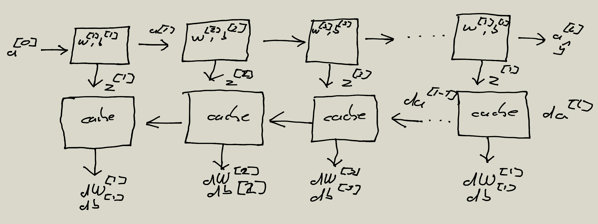

## Normalizing inputs

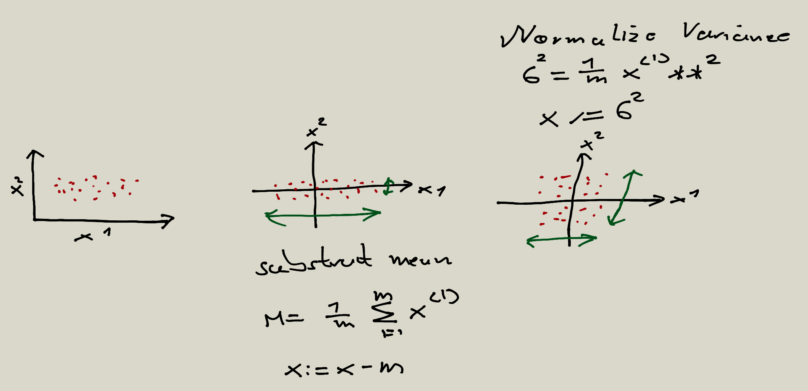

### Why normalzing inputs 

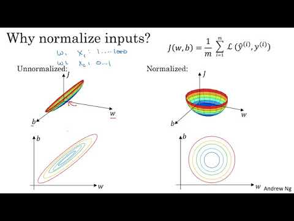

### Batch normalizing 

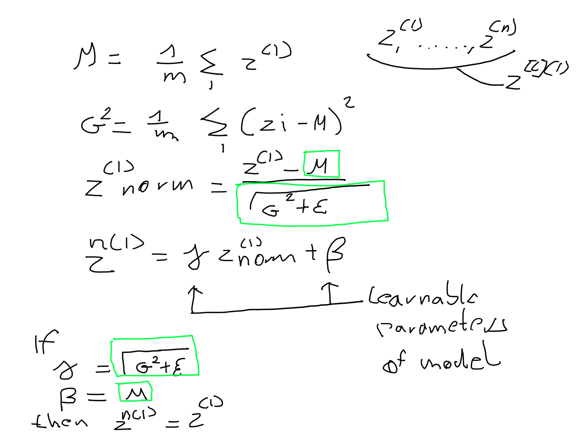