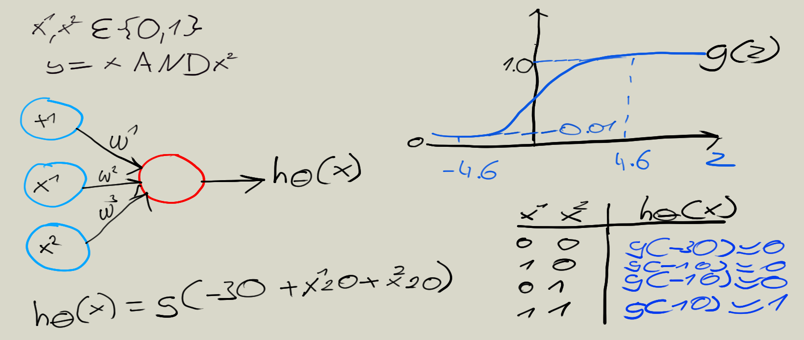
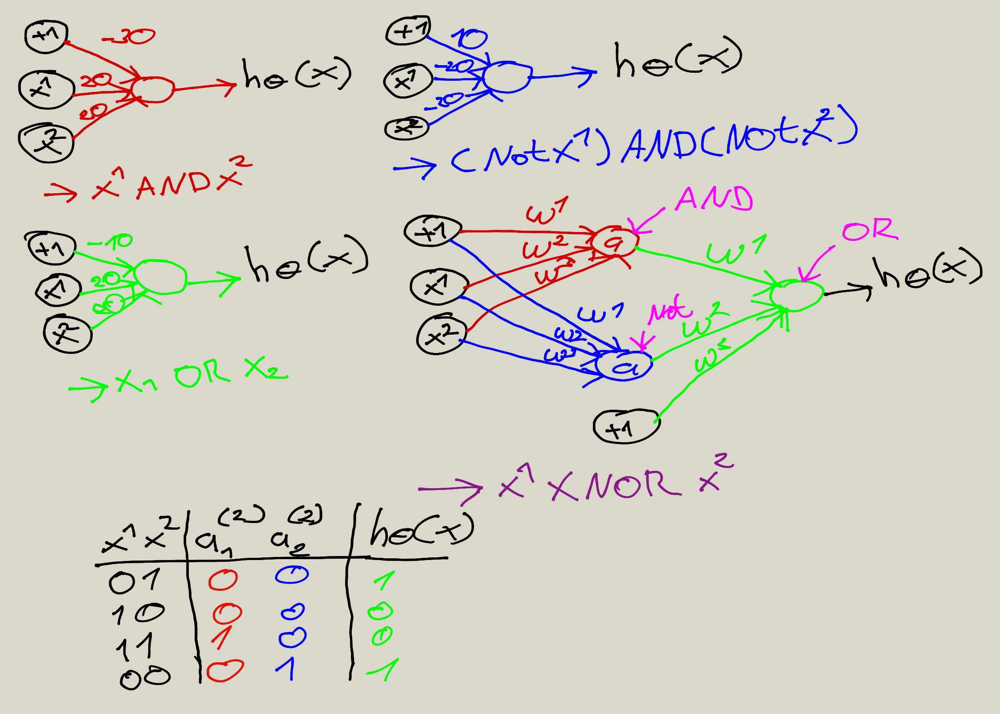

# Neural networks

## Legend
* Input wries == Dendrite 
* Output wire == Axon

## Neuron model: Logistic unit

## Neural Network

if network has sj units in layer j, sj + 1 units in layer j + 1, 0j then will be of diemension sj+1 * (sj +1). 

### Other Neural Network Architectures

### Binary Neural Network (AND)

### Binary Neural Network (XNOR)

### Neural network logistic regression cost function

### Back propagation 

