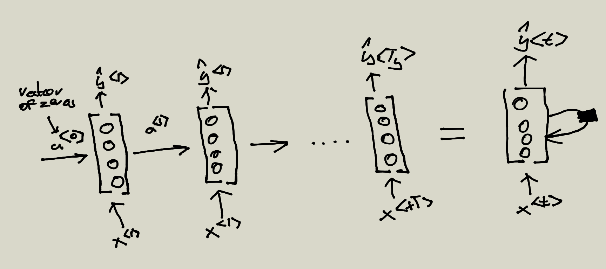
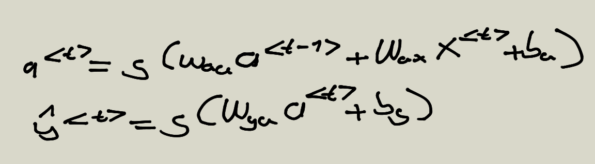
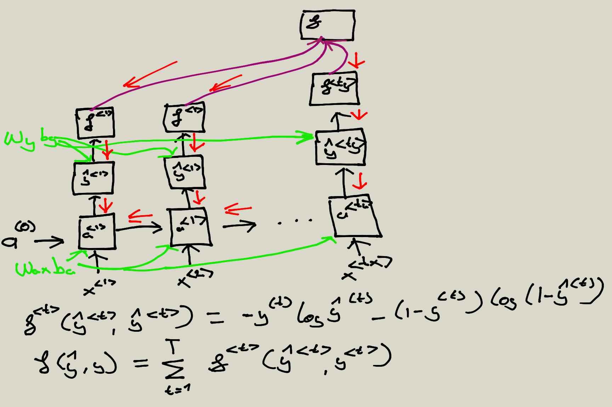
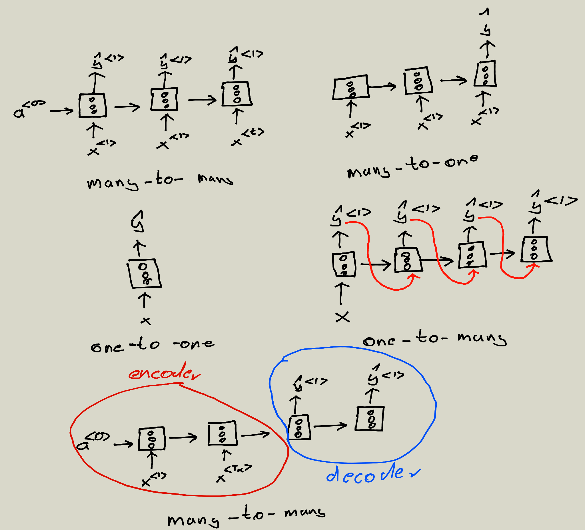
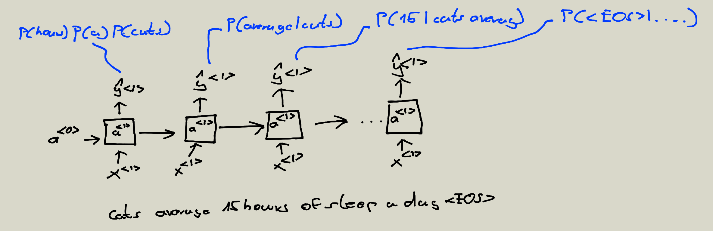
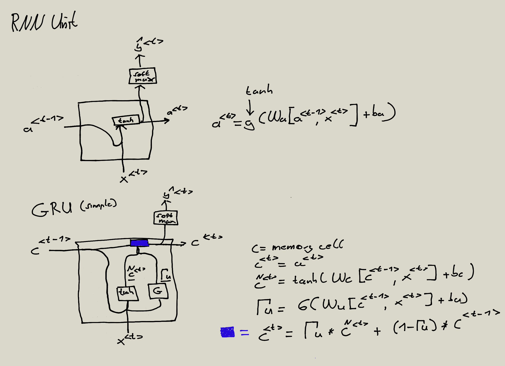
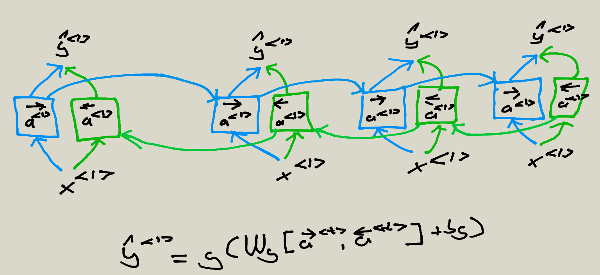
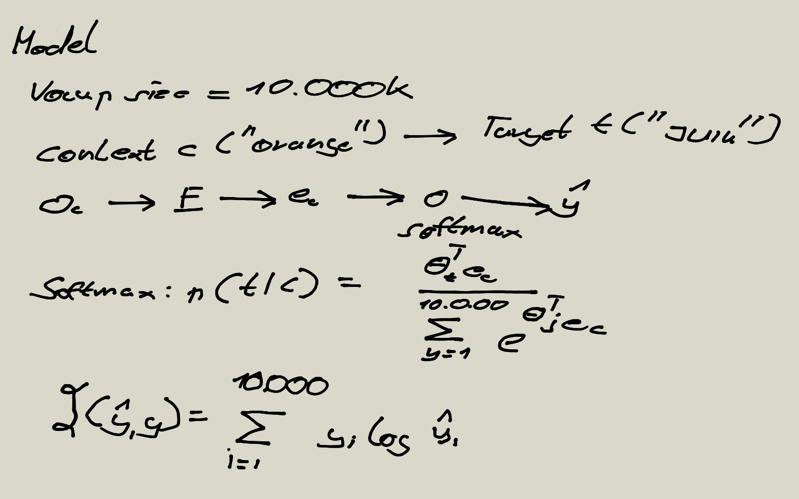

# Recurrent neural networks

## Predict a y 

## RNN notation

## Forward propagation and back propagation (through time)

## Different types of RNNs

## Language model and sequence generation

## Gated Recurrent Unit GRU

## Bidirectional RNN 

## Skip-grams

