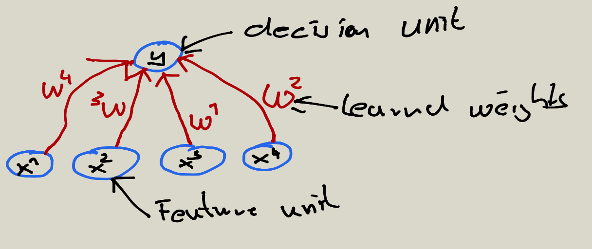

# The standard paradigm for statistical pattern recognition 

1. Convert the raw input vector into a vector of feature activations
2. Learn how to weight each of the feature activations to get a single scalar quantity.
3. If this quantity is above some threshold, decide that the input vector is a positive example of the target class

## The standard perceptron architecture (First generation of Neural networks)

